<p align="center">
  
</p>

<div align="center">
  
</div>

---

<div align="center">

## ⚡ **ᴍᴀᴊᴏʀ ᴜᴘᴅᴀᴛᴇ - ɴᴏᴡ ʀᴜɴɴɪɴɢ ᴏɴ ᴀᴘɪ!** ⚡

### 🚀 **ʟɪɢʜᴛɴɪɴɢ ғᴀsᴛ ᴘᴇʀғᴏʀᴍᴀɴᴄᴇ** 🚀
> **Response Time:** `1-3 seconds` | **Speed Boost:** `10x Faster` | **Stability:** `99.9% Uptime`

</div>

---

<div align="center">

### 🎁 **ɢᴇᴛ ʏᴏᴜʀ ᴀᴘɪ ᴋᴇʏ** (ʀᴇǫᴜɪʀᴇᴅ ғᴏʀ ᴀʟʟ ᴜsᴇʀs) 🎁

</div>

<table align="center">
<tr>
<td align="center" width="50%">

### 🆕 **ɴᴇᴡ ᴜsᴇʀs**

1. 🌐 **[ᴄʟɪᴄᴋ ʜᴇʀᴇ ᴛᴏ sɪɢɴ ᴜᴘ](https://panel.thequickearn.xyz/signup?ref=NGBM6HYNQKU)**
   - 🎁 **ᴇxᴄʟᴜsɪᴠᴇ ᴡᴇʟᴄᴏᴍᴇ ʙᴏɴᴜs**
   - 💎 **ʀᴀɴᴅᴏᴍ ʀᴇᴡᴀʀᴅs**
   - 🏆 **ᴘʀɪᴏʀɪᴛʏ sᴜᴘᴘᴏʀᴛ**

2. 📝 **ʀᴇɢɪsᴛᴇʀ** (60 sᴇᴄᴏɴᴅs)

3. 🔑 **ᴄᴏᴘʏ ᴀᴘɪ ᴋᴇʏ** ғʀᴏᴍ ᴅᴀsʜʙᴏᴀʀᴅ

4. ⚙️ **ᴀᴅᴅ** `API_KEY=your_key`

5. ✅ **ᴅᴇᴘʟᴏʏ & ᴇɴᴊᴏʏ!**

</td>
<td align="center" width="50%">

### 🔄 **ᴇxɪsᴛɪɴɢ ᴜsᴇʀs** (ғᴏʀᴋs)

1. 📂 **ᴜᴘᴅᴀᴛᴇ ғɪʟᴇ:**
   - `ShrutiMusic/platforms/Youtube.py`
   - ʀᴇᴘʟᴀᴄᴇ ᴡɪᴛʜ ʟᴀᴛᴇsᴛ ᴄᴏᴅᴇ

2. 🌐 **[ɢᴇᴛ ᴀᴘɪ ᴋᴇʏ](https://panel.thequickearn.xyz/signup?ref=NGBM6HYNQKU)**
   - 🎁 **sᴘᴇᴄɪᴀʟ ᴏғғᴇʀs**

3. ⚙️ **ᴀᴅᴅ ᴠᴀʀɪᴀʙʟᴇ:**
   - `API_KEY=your_key`

4. 🔄 **ʀᴇᴅᴇᴘʟᴏʏ:**
   - `git pull origin main`

5. ✅ **ᴅᴏɴᴇ!**

</td>
</tr>
</table>

<div align="center">

### 💫 **ᴡʜʏ ᴜᴘɢʀᴀᴅᴇ ᴛᴏ ᴀᴘɪ?** 💫

| ✨ **ɴᴏ ᴄᴏᴏᴋɪᴇ ᴍᴀɴᴀɢᴇᴍᴇɴᴛ** | ⚡ **10x ғᴀsᴛᴇʀ** | 🔒 **ᴍᴏʀᴇ sᴛᴀʙʟᴇ** | 🎯 **ʙᴇᴛᴛᴇʀ ǫᴜᴀʟɪᴛʏ** |
|:---:|:---:|:---:|:---:|

</div>

---

<div align="center">
  
# 🎵 **ғʀᴇsʜ ᴍᴜsɪᴄ ʙᴏᴛ** 🎵
  
### ᴀ ᴘᴏᴡᴇʀғᴜʟ ᴛᴇʟᴇɢʀᴀᴍ ᴍᴜsɪᴄ ʙᴏᴛ ᴛᴏ ᴘʟᴀʏ sᴏɴɢs ɪɴ ᴠᴏɪᴄᴇ ᴄʜᴀᴛs
  
[](https://t.me/fine_n_ok)
[](https://t.me/pyaarkiyatha)
[](https://t.me/MehExclusive)

[](https://github.com/karmaxexclusive/FreshMusic/fork)
[](https://github.com/karmaxexclusive/FreshMusic/stargazers)
[](https://github.com/karmaxexclusive/FreshMusic/graphs/contributors)

</div>

---

## 🚀 **ǫᴜɪᴄᴋ ᴅᴇᴘʟᴏʏ ᴏᴘᴛɪᴏɴs**

<div align="center">
  
<table>
<tr>
<td align="center" width="33%">

### 🔥 **ʜᴇʀᴏᴋᴜ**
<a href="https://dashboard.heroku.com/new?template=https://github.com/karmaxexclusive/FreshMusic">

</a>

**ᴏɴᴇ-ᴄʟɪᴄᴋ ᴅᴇᴘʟᴏʏ**

</td>
<td align="center" width="33%">

### ☁️ **ʀᴇɴᴅᴇʀ**
<a href="https://render.com/deploy?repo=https://github.com/karmaxexclusive/FreshMusic">

</a>

**100% ғʀᴇᴇ**

</td>
<td align="center" width="33%">

### 🎵 **sɪᴍᴘʟᴇ ʙᴏᴛ**
<a href="https://github.com/karmaxexclusive/FreshMusic">

</a>

**ʟɪɢʜᴛᴡᴇɪɢʜᴛ**

</td>
</tr>
</table>
  
</div>

---

## ✨ **ғᴇᴀᴛᴜʀᴇs**

<div align="center">

<table>
<tr>
<td align="center" width="25%">

### 🎵
### **ᴘʟᴀʏ ᴍᴜsɪᴄ**
sᴛʀᴇᴀᴍ ʜɪɢʜ-ǫᴜᴀʟɪᴛʏ ᴍᴜsɪᴄ ɪɴ ᴛᴇʟᴇɢʀᴀᴍ ᴠᴏɪᴄᴇ ᴄʜᴀᴛs

</td>
<td align="center" width="25%">

### 🔗
### **ᴍᴜʟᴛɪᴘʟᴇ sᴏᴜʀᴄᴇs**
ʏᴏᴜᴛᴜʙᴇ • sᴘᴏᴛɪғʏ
sᴏᴜɴᴅᴄʟᴏᴜᴅ • ʟᴏᴄᴀʟ ғɪʟᴇs

</td>
<td align="center" width="25%">

### 📋
### **ᴘʟᴀʏʟɪsᴛs**
ᴄʀᴇᴀᴛᴇ ᴀɴᴅ ᴍᴀɴᴀɢᴇ ᴘʟᴀʏʟɪsᴛs ғᴏʀ ʏᴏᴜʀ ɢʀᴏᴜᴘ

</td>
<td align="center" width="25%">

### 🌐
### **ᴍᴜʟᴛɪ-ʟᴀɴɢᴜᴀɢᴇ**
ᴀᴠᴀɪʟᴀʙʟᴇ ɪɴ ᴍᴜʟᴛɪᴘʟᴇ ʟᴀɴɢᴜᴀɢᴇs

</td>
</tr>
<tr>
<td align="center" width="25%">

### 🎨
### **ᴇʟᴇɢᴀɴᴛ ᴜɪ**
ᴄʟᴇᴀɴ ᴀɴᴅ ᴍᴏᴅᴇʀɴ ᴜsᴇʀ ɪɴᴛᴇʀғᴀᴄᴇ

</td>
<td align="center" width="25%">

### 👑
### **ɢʀᴏᴜᴘ ᴍᴀɴᴀɢᴇᴍᴇɴᴛ**
ᴘᴏᴡᴇʀғᴜʟ ᴀᴅᴍɪɴ ᴄᴏᴍᴍᴀɴᴅs

</td>
<td align="center" width="25%">

### 🔊
### **ʜɪɢʜ ǫᴜᴀʟɪᴛʏ**
ᴄʀʏsᴛᴀʟ ᴄʟᴇᴀʀ ᴀᴜᴅɪᴏ sᴛʀᴇᴀᴍɪɴɢ

</td>
<td align="center" width="25%">

### ⚡
### **ғᴀsᴛ & ʀᴇʟɪᴀʙʟᴇ**
ʟɪɢʜᴛɴɪɴɢ ғᴀsᴛ ʀᴇsᴘᴏɴsᴇ ᴛɪᴍᴇ

</td>
</tr>
</table>

</div>

---

## 📊 **ʀᴇᴘᴏsɪᴛᴏʀʏ sᴛᴀᴛs**

<div align="center">


</div>

---

## 🔥 **ᴇssᴇɴᴛɪᴀʟ ᴄᴏᴍᴍᴀɴᴅs**

<div align="center">

| **ᴄᴏᴍᴍᴀɴᴅ** | **ᴅᴇsᴄʀɪᴘᴛɪᴏɴ** | **ᴜsᴀɢᴇ** |
|:---:|:---:|:---:|
| `/play` | 🎵 ᴘʟᴀʏ sᴏɴɢ ғʀᴏᴍ ʏᴏᴜᴛᴜʙᴇ | `/play [song name/URL]` |
| `/pause` | ⏸️ ᴘᴀᴜsᴇ ᴛʜᴇ ᴄᴜʀʀᴇɴᴛ sᴛʀᴇᴀᴍ | `/pause` |
| `/resume` | ▶️ ʀᴇsᴜᴍᴇ ᴛʜᴇ ᴘᴀᴜsᴇᴅ sᴛʀᴇᴀᴍ | `/resume` |
| `/skip` | ⏭️ sᴋɪᴘ ᴛᴏ ᴛʜᴇ ɴᴇxᴛ sᴏɴɢ | `/skip` |
| `/stop` | ⏹️ sᴛᴏᴘ ᴛʜᴇ sᴛʀᴇᴀᴍɪɴɢ | `/stop` |
| `/playlist` | 📋 sʜᴏᴡ ᴛʜᴇ ᴘʟᴀʏʟɪsᴛ | `/playlist` |
| `/song` | 📥 ᴅᴏᴡɴʟᴏᴀᴅ ᴀ sᴏɴɢ ᴀs ᴀᴜᴅɪᴏ | `/song [song name]` |
| `/settings` | ⚙️ ᴏᴘᴇɴ ʙᴏᴛ sᴇᴛᴛɪɴɢs | `/settings` |

</div>

---

## 🚀 **ᴅᴇᴘʟᴏʏᴍᴇɴᴛ ɢᴜɪᴅᴇ**

### 🔧 **ᴠᴘs ᴅᴇᴘʟᴏʏᴍᴇɴᴛ** (sᴛᴇᴘ ʙʏ sᴛᴇᴘ)

#### **📦 ᴘʀᴇʀᴇǫᴜɪsɪᴛᴇs**

**ᴜᴘᴅᴀᴛᴇ sʏsᴛᴇᴍ:**
```bash
sudo apt-get update && sudo apt-get upgrade -y
```

**ɪɴsᴛᴀʟʟ ᴘᴀᴄᴋᴀɢᴇs:**
```bash
sudo apt-get install python3 python3-pip ffmpeg git screen curl -y
```

**ɪɴsᴛᴀʟʟ ɴᴏᴅᴇ.ᴊs:**
```bash
curl -fsSL https://deb.nodesource.com/setup_lts.x | sudo -E bash -
sudo apt-get install -y nodejs
```

---

#### **📂 ᴄʟᴏɴᴇ ʀᴇᴘᴏsɪᴛᴏʀʏ**

```bash
git clone https://github.com/karmaxexclusive/FreshMusic
cd ShrutiMusic
```

---

#### **🖥️ sᴇᴛᴜᴘ sᴄʀᴇᴇɴ** (24/7 ʀᴜɴɴɪɴɢ)

```bash
screen
```

---

#### **🐍 ᴠɪʀᴛᴜᴀʟ ᴇɴᴠɪʀᴏɴᴍᴇɴᴛ**

```bash
python3 -m venv venv
source venv/bin/activate
```

---

#### **📦 ɪɴsᴛᴀʟʟ ᴅᴇᴘᴇɴᴅᴇɴᴄɪᴇs**

```bash
pip3 install -U pip
pip3 install -U -r requirements.txt
```

---

#### **⚙️ ᴄᴏɴғɪɢᴜʀᴀᴛɪᴏɴ**

```bash
nano .env
```

**ғɪʟʟ ɪɴ ʏᴏᴜʀ ᴠᴀʀɪᴀʙʟᴇs:**

- `API_ID` & `API_HASH` - ғʀᴏᴍ [my.telegram.org](https://my.telegram.org)
- `BOT_TOKEN` - ғʀᴏᴍ [@BotFather](https://t.me/BotFather)
- `MONGO_DB_URI` - ғʀᴏᴍ ʏᴏᴜʀ ᴍᴏɴɢᴏᴅʙ ᴀᴛʟᴀs ᴄʟᴜsᴛᴇʀ
- `OWNER_ID` - ʏᴏᴜʀ ᴛᴇʟᴇɢʀᴀᴍ ᴜsᴇʀ ɪᴅ
- `OWNER_USERNAME` - ʏᴏᴜʀ ᴛᴇʟᴇɢʀᴀᴍ ᴜsᴇʀɴᴀᴍᴇ (ᴡɪᴛʜᴏᴜᴛ @)
- `BOT_USERNAME` - ʏᴏᴜʀ ʙᴏᴛ's ᴜsᴇʀɴᴀᴍᴇ (ᴡɪᴛʜᴏᴜᴛ @)
- `UPSTREAM_REPO` - ɢɪᴛʜᴜʙ ʀᴇᴘᴏ ᴜʀʟ ғᴏʀ ᴜᴘᴅᴀᴛᴇs
- `STRING_SESSION` - ɢᴇɴᴇʀᴀᴛᴇ ᴜsɪɴɢ [@Sessionbbbot](https://t.me/Sessionbbbot)
- `GIT_TOKEN` - ɪғ ʏᴏᴜʀ ʀᴇᴘᴏ ɪs ᴘʀɪᴠᴀᴛᴇ
- `LOG_GROUP_ID` - ʟᴏɢ ɢʀᴏᴜᴘ/ᴄʜᴀɴɴᴇʟ ɪᴅ (sᴛᴀʀᴛɪɴɢ ᴡɪᴛʜ -100)
- `SUPPORT_GROUP` - ғᴜʟʟ ʟɪɴᴋ ᴏғ ʏᴏᴜʀ sᴜᴘᴘᴏʀᴛ ɢʀᴏᴜᴘ
- `SUPPORT_CHANNEL` - ғᴜʟʟ ʟɪɴᴋ ᴏғ ʏᴏᴜʀ sᴜᴘᴘᴏʀᴛ ᴄʜᴀɴɴᴇʟ
- `API_KEY` 🎁 **[ʀᴇǫᴜɪʀᴇᴅ]** - [**ᴄʟɪᴄᴋ ʜᴇʀᴇ ᴛᴏ ɢᴇᴛ**](https://panel.thequickearn.xyz/signup?ref=NGBM6HYNQKU) (**ᴇxᴄʟᴜsɪᴠᴇ ʙᴏɴᴜsᴇs ᴀᴠᴀɪʟᴀʙʟᴇ!**)
- `START_IMG_URL` - ɪᴍᴀɢᴇ ᴜʀʟ ғᴏʀ /sᴛᴀʀᴛ ᴍᴇssᴀɢᴇ ᴛʜᴜᴍʙɴᴀɪʟ

> **📝 ɴᴏᴛᴇ:** `COOKIE_URL` ɪs ɴᴏ ʟᴏɴɢᴇʀ ɴᴇᴇᴅᴇᴅ ᴡɪᴛʜ ᴛʜᴇ ɴᴇᴡ ᴀᴘɪ sʏsᴛᴇᴍ!

---

#### **▶️ sᴛᴀʀᴛɪɴɢ ᴛʜᴇ ʙᴏᴛ**

**ᴍᴇᴛʜᴏᴅ 1:** ᴜsɪɴɢ ᴘʏᴛʜᴏɴ
```bash
python3 -m ShrutiMusic
```

**ᴍᴇᴛʜᴏᴅ 2:** ᴜsɪɴɢ ʙᴀsʜ sᴄʀɪᴘᴛ
```bash
bash start
```

**ᴅᴇᴛᴀᴄʜ sᴄʀᴇᴇɴ:** `Ctrl+A` ᴛʜᴇɴ `D`

**ʀᴇᴀᴛᴛᴀᴄʜ sᴄʀᴇᴇɴ:**
```bash
screen -ls
screen -r {screen_id}
```

**ᴇxᴀᴍᴘʟᴇ:** `screen -r 108108`

---

## ☁️ **ʜᴇʀᴏᴋᴜ ᴅᴇᴘʟᴏʏᴍᴇɴᴛ**

<div align="center">

[](https://dashboard.heroku.com/new?template=https://github.com/iambuddy01/FreshMusic)

</div>

### **📝 sᴛᴇᴘs:**

1. **ᴄʟɪᴄᴋ ᴛʜᴇ ʙᴜᴛᴛᴏɴ ᴀʙᴏᴠᴇ**

2. **ғɪʟʟ ɪɴ ᴛʜᴇ ʀᴇǫᴜɪʀᴇᴅ ᴅᴇᴛᴀɪʟs:**
   - ᴀᴘᴘ ɴᴀᴍᴇ
   - `API_ID` & `API_HASH`
   - `BOT_TOKEN`
   - `MUSIC_BOT_NAME`
   - `STRING_SESSION`
   - `SUDO_USERS` (ʏᴏᴜʀ ᴜsᴇʀ ɪᴅ)
   - `API_KEY` 🎁 - [**ɢᴇᴛ ғʀᴏᴍ ʜᴇʀᴇ**](https://panel.thequickearn.xyz/signup?ref=NGBM6HYNQKU) (**ʙᴏɴᴜs ᴏғғᴇʀs ɪɴᴄʟᴜᴅᴇᴅ!**)

3. **ᴄʟɪᴄᴋ "ᴅᴇᴘʟᴏʏ ᴀᴘᴘ"**

4. **ɢᴏ ᴛᴏ ʀᴇsᴏᴜʀᴄᴇs ᴛᴀʙ ᴀɴᴅ ᴛᴜʀɴ ᴏɴ ᴛʜᴇ ᴡᴏʀᴋᴇʀ**

---

## 🔄 **ʜᴏᴡ ᴛᴏ ɢᴇɴᴇʀᴀᴛᴇ sᴇssɪᴏɴ sᴛʀɪɴɢ**

<div align="center">

### 🤖 **ᴜsᴇ ᴏᴜʀ sᴇssɪᴏɴ ɢᴇɴᴇʀᴀᴛᴏʀ ʙᴏᴛ**

[](https://t.me/Sessionbbbot)

</div>

**sᴛᴇᴘs:**
1. 🤖 **sᴛᴀʀᴛ ᴛʜᴇ ʙᴏᴛ** - [@Sessionbbbot](https://t.me/Sessionbbbot)
2. 📱 **sᴇɴᴅ ᴘʜᴏɴᴇ ɴᴜᴍʙᴇʀ** ᴡɪᴛʜ ᴄᴏᴜɴᴛʀʏ ᴄᴏᴅᴇ
3. 🔢 **ᴇɴᴛᴇʀ ᴛʜᴇ ᴏᴛᴘ**
4. ✅ **ʏᴏᴜʀ sᴇssɪᴏɴ sᴛʀɪɴɢ ᴡɪʟʟ ʙᴇ ɢᴇɴᴇʀᴀᴛᴇᴅ**

---

## 🤔 **ᴄᴏᴍᴍᴏɴ ɪssᴜᴇs & ғɪxᴇs**

<div align="center">

| **ɪssᴜᴇ** | **sᴏʟᴜᴛɪᴏɴ** |
|:---:|:---:|
| 🤖 **ʙᴏᴛ ɴᴏᴛ ʀᴇsᴘᴏɴᴅɪɴɢ** | ᴄʜᴇᴄᴋ ɪғ ᴛʜᴇ ʙᴏᴛ ɪs ʀᴜɴɴɪɴɢ ᴀɴᴅ ʜᴀs ᴘʀᴏᴘᴇʀ ᴘᴇʀᴍɪssɪᴏɴs |
| 🔇 **ɴᴏ sᴏᴜɴᴅ ɪɴ ᴠᴄ** | ᴇɴsᴜʀᴇ ғғᴍᴘᴇɢ ɪs ᴘʀᴏᴘᴇʀʟʏ ɪɴsᴛᴀʟʟᴇᴅ |
| 🚫 **ᴄᴀɴ'ᴛ ᴊᴏɪɴ ᴠᴏɪᴄᴇ ᴄʜᴀᴛ** | ᴍᴀᴋᴇ sᴜʀᴇ ᴛʜᴇ ʙᴏᴛ ɪs ᴀɴ ᴀᴅᴍɪɴ ᴡɪᴛʜ ᴠᴄ ᴘᴇʀᴍɪssɪᴏɴs |
| ⚠️ **ᴀᴘɪ ɪssᴜᴇs** | ᴅᴏᴜʙʟᴇ ᴄʜᴇᴄᴋ ʏᴏᴜʀ `API_ID` ᴀɴᴅ `API_HASH` |
| 🔑 **ɪɴᴠᴀʟɪᴅ ᴀᴘɪ_ᴋᴇʏ** | ᴠᴇʀɪғʏ ʏᴏᴜʀ ᴀᴘɪ ᴋᴇʏ ғʀᴏᴍ [ᴘᴀɴᴇʟ](https://panel.thequickearn.xyz/signup?ref=NGBM6HYNQKU) |
| ⏱️ **sʟᴏᴡ ʀᴇsᴘᴏɴsᴇ** | ᴜᴘɢʀᴀᴅᴇ ᴛᴏ ᴀᴘɪ sʏsᴛᴇᴍ ғᴏʀ 10x sᴘᴇᴇᴅ |

</div>

---

## 🌟 **ᴄʀᴇᴅɪᴛs ᴀɴᴅ ᴀᴄᴋɴᴏᴡʟᴇᴅɢᴇᴍᴇɴᴛs**

<div align="center">

### 👨‍💻 **ᴍᴀɪɴ ᴅᴇᴠᴇʟᴏᴘᴇʀ**

[](https://github.com/karmaxexclusive)

### 🙏 **sᴘᴇᴄɪᴀʟ ᴛʜᴀɴᴋs**

**ᴀʟʟ ᴄᴏɴᴛʀɪʙᴜᴛᴏʀs ᴡʜᴏ ʜᴇʟᴘᴇᴅ ᴍᴀᴋᴇ ᴛʜɪs ᴘʀᴏᴊᴇᴄᴛ ʙᴇᴛᴛᴇʀ**

</div>

---

## 📝 **ʟɪᴄᴇɴsᴇ**

<div align="center">

**ᴛʜɪs ᴘʀᴏᴊᴇᴄᴛ ɪs ʟɪᴄᴇɴsᴇᴅ ᴜɴᴅᴇʀ ᴛʜᴇ**

[](LICENSE)

</div>

---

## 📞 **sᴜᴘᴘᴏʀᴛ**

<div align="center">

### 💬 **ғᴏʀ ᴀɴʏ ǫᴜᴇsᴛɪᴏɴs ᴏʀ ʜᴇʟᴘ, ᴊᴏɪɴ ᴏᴜʀ sᴜᴘᴘᴏʀᴛ ɢʀᴏᴜᴘ**

<table>
<tr>
<td align="center" width="50%">

### 📢 **sᴜᴘᴘᴏʀᴛ ᴄʜᴀɴɴᴇʟ**
[](https://t.me/fine_n_ok) 

**ɢᴇᴛ ʟᴀᴛᴇsᴛ ᴜᴘᴅᴀᴛᴇs**

</td>
<td align="center" width="50%">

### 💬 **sᴜᴘᴘᴏʀᴛ ɢʀᴏᴜᴘ**
[](https://t.me/pyaarkiyatha)

**24/7 ʜᴇʟᴘ & sᴜᴘᴘᴏʀᴛ**

</td>
</tr>
</table>

---

### 🎯 **ǫᴜɪᴄᴋ ʟɪɴᴋs**

<table align="center">
<tr>
<td align="center" width="33%">

#### 🎁 **ɢᴇᴛ ᴀᴘɪ ᴋᴇʏ**
[](https://panel.thequickearn.xyz/signup?ref=NGBM6HYNQKU)

**ᴇxᴄʟᴜsɪᴠᴇ ʙᴏɴᴜsᴇs**

</td>
<td align="center" width="33%">

#### 📚 **ᴅᴏᴄᴜᴍᴇɴᴛᴀᴛɪᴏɴ**
[](https://github.com/karmaxexclusive)

**ᴄᴏᴍᴘʟᴇᴛᴇ ɢᴜɪᴅᴇ**

</td>
<td align="center" width="33%">

#### 🔗 **sᴇssɪᴏɴ ʙᴏᴛ**
[](https://t.me/Sessionbbbot)

**ғᴀsᴛ & sᴇᴄᴜʀᴇ**

</td>
</tr>
</table>

---


---

<h1 align="center">🎵 ᴇɴᴊᴏʏ sᴛʀᴇᴀᴍɪɴɢ ᴍᴜsɪᴄ ᴡɪᴛʜ sʜʀᴜᴛɪ ʙᴏᴛ! 🎵</h1>

<p align="center">
  
</p>

</div>
